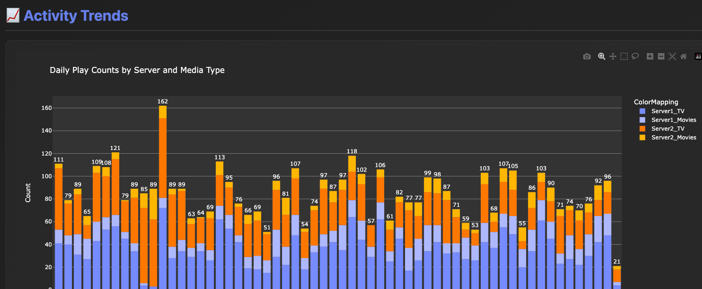

# MultiPlex Stats 📊

**A modern web application for combining and visualizing statistics from multiple Tautulli/Plex servers in one unified dashboard.**




Monitor your Plex Media Server ecosystem with beautiful interactive charts, user analytics, and content insights - all accessible through an easy-to-use web interface.

---

## ✨ Features

- 🌐 **Web Interface** - Configure servers and view analytics directly in your browser
- 📈 **Interactive Charts** - 7 beautiful Plotly visualizations with hover details
- 🖥️ **Multi-Server Support** - Combine statistics from up to 2 Tautulli servers
- 👥 **User Analytics** - Track your most active users and viewing patterns
- 🎬 **Content Insights** - Discover your most popular movies and TV shows
- 📊 **Trend Analysis** - Daily and monthly viewing trends over time
- ⚙️ **Easy Configuration** - Web-based settings management (no config file editing!)
- 🔄 **One-Click Refresh** - Update your analytics with a single button click
- 💾 **Data Export** - CSV exports for further analysis in Excel or other tools

---

## 🚀 Quick Start

### Option 1: Docker (Recommended)

The easiest way to run MultiPlex Stats is with Docker:

```bash
docker run -d \
  --name multiplex-stats \
  -p 8487:8487 \
  -v multiplex-data:/app/instance \
  powertowerpro/multiplex_stats:latest
```

Or using docker-compose:

```yaml
services:
  multiplex-stats:
    image: powertowerpro/multiplex_stats:latest
    container_name: multiplex-stats
    ports:
      - "8487:8487"
    volumes:
      - ./instance:/app/instance
    restart: unless-stopped
```

Then:
```bash
docker-compose up -d
```

Open your browser to: **http://localhost:8487**

### Option 2: Manual Installation

Clone the repository and install dependencies:

```bash
git clone https://github.com/apollolabsai/MultiPlex-Stats.git
cd MultiPlex-Stats
pip3 install -r requirements.txt
```

Start the web server:

```bash
python3 run_multiplex_stats.py
```

Open your browser to: **http://127.0.0.1:8487**

### Configure Your Servers

On first launch, you'll be redirected to the Settings page:

1. **Add Server A** (required):
   - Enter a server name (e.g., "Main Server")
   - Enter IP:Port (e.g., `192.168.1.101:8181`)
   - Paste your Tautulli API key

2. **Add Server B** (optional):
   - Same process for your second server
   - Leave blank if you only have one server

3. **Configure Analytics Settings**:
   - Set time ranges (days/months to analyze)
   - Set number of top items to display

**Finding Your Tautulli API Key:**
1. Open Tautulli in your browser
2. Navigate to: Settings → Web Interface → API
3. Copy the API key

**HTTPS/SSL Support:**
- Check "Use HTTPS/SSL" if your Tautulli server uses HTTPS
- Leave "Verify SSL Certificate" unchecked if using self-signed certificates

### Run Analytics

1. Click the **"Run Analytics"** button on the home page
2. Wait 30-60 seconds while data is fetched and processed
3. View your dashboard with all charts and statistics

---

## 📊 What You'll See

### Dashboard Overview

The web dashboard displays comprehensive analytics across 7 interactive visualizations:

#### Activity Trends
- **Daily Bar Chart** - Last 60 days of viewing activity by server and media type
- **Monthly Bar Chart** - Long-term trends showing up to 60 months of history

#### Distribution Analysis
- **Category Pie Chart** - TV vs Movies breakdown
- **Server Pie Chart** - Activity distribution across your servers

#### User Insights
- **User Activity Chart** - Top 20 most active users ranked by play count

#### Content Rankings
- **Top Movies Chart** - Your 30 most-watched movies
- **Top TV Shows Chart** - Your 30 most-watched TV series

#### Summary Statistics
- Total plays across all servers
- Number of active users
- Per-server play counts
- Unique movies and TV shows in your library

---

## 🎯 Web Interface Guide

### Home Page
- View last analytics run status and timestamp
- See configured servers at a glance
- One-click button to run analytics
- Quick access to dashboard and settings

### Dashboard Page
- Interactive charts with hover tooltips and zoom
- Summary statistics cards at the top
- **Refresh Analytics** button to rerun with latest data
- Charts organized by category for easy navigation

### Settings Page
- **Server Configuration**:
  - Add, edit, or remove Tautulli servers
  - Specify server order (A/B)
  - Test connections before saving

- **Analytics Settings**:
  - Daily trend days (1-365)
  - Monthly trend months (1-120)
  - History analysis period (1-365 days)
  - Number of top movies/shows/users to display

- **Import Config**:
  - Import from existing `config.ini` file
  - Useful for migrating from CLI to web interface

---

## 🖥️ CLI Mode (Optional)

For automation, cron jobs, or scripting, you can still use the command-line interface:

### Setup with config.ini

1. Copy the example config:
   ```bash
   cp config.ini.example config.ini
   ```

2. Edit `config.ini` with your server details:
   ```ini
   [ServerA]
   name = Server1
   ip_address = 192.168.1.101:8181
   api_key = your_tautulli_api_key_here

   [ServerB]  # Optional - remove if not needed
   name = Server2
   ip_address = 192.168.1.102:8181
   api_key = your_tautulli_api_key_here

   [Settings]
   daily_trend_days = 60
   monthly_trend_months = 60
   history_days = 60
   top_movies = 30
   top_tv_shows = 30
   top_users = 20
   ```

3. Run the analytics script:
   ```bash
   python3 run_analytics.py
   ```

### CLI Output

The CLI script generates:
- **`dashboard.html`** - Standalone HTML dashboard (can be opened in any browser)
- **`history_data.csv`** - Full viewing history
- **`user_stats.csv`** - User statistics
- **`movie_stats.csv`** - Movie rankings
- **`tv_stats.csv`** - TV show rankings

### Web vs CLI Comparison

| Feature | Web Interface | CLI Script |
|---------|--------------|------------|
| Configuration | Web forms | config.ini file |
| Running Analytics | Click button | Run command |
| View Dashboard | In-browser | Open dashboard.html |
| Automation | Manual | Cron/scheduled tasks |
| Best For | Interactive use | Automation/scripting |

**💡 Pro Tip:** Both methods work side-by-side! Use the web interface for daily viewing and configuration, and CLI for automated scheduled runs.

---

## 📁 Project Structure

```
MultiPlex_Stats/
├── flask_app/                    # Web application
│   ├── routes/                   # URL routes (dashboard, settings)
│   │   ├── main.py              # Home, dashboard, analytics execution
│   │   └── settings.py          # Server & analytics configuration
│   ├── services/                 # Business logic layer
│   │   ├── analytics_service.py # Analytics execution & caching
│   │   └── config_service.py    # Database configuration management
│   ├── templates/                # HTML templates (Jinja2)
│   │   ├── base.html            # Base layout with navbar
│   │   ├── index.html           # Landing page
│   │   ├── dashboard.html       # Analytics dashboard
│   │   └── settings.html        # Configuration forms
│   ├── static/                   # Static assets
│   │   └── css/style.css        # Dark theme styling
│   ├── utils/                    # Utilities
│   │   └── validators.py        # Form validation
│   ├── models.py                # Database models (SQLAlchemy)
│   └── config.py                # Flask configuration
│
├── multiplex_stats/              # Core analytics engine
│   ├── api_client.py            # Tautulli API client
│   ├── data_processing.py       # Data transformation & aggregation
│   ├── visualization.py         # Plotly chart generation
│   ├── models.py                # Data models
│   ├── config_loader.py         # Configuration loader
│   └── utils.py                 # Helper functions
│
├── instance/                     # Runtime data (auto-created)
│   ├── multiplex_stats.db       # SQLite database
│   └── cache/                   # Cached chart HTML
│
├── run_multiplex_stats.py       # Web interface entry point
├── run_analytics.py             # CLI script entry point
├── requirements.txt             # Python dependencies
├── config.ini.example           # CLI config template
└── README.md                    # This file
```

---

## ⚙️ Configuration Options

### Analytics Settings

Customize your analytics through the web interface Settings page:

| Setting | Default | Range | Description |
|---------|---------|-------|-------------|
| Daily Trend Days | 60 | 1-365 | Days to display in daily activity chart |
| Monthly Trend Months | 60 | 1-120 | Months to display in monthly chart |
| History Days | 60 | 1-365 | Days of history for user/content analysis |
| Top Movies | 30 | 1-100 | Number of top movies to show |
| Top TV Shows | 30 | 1-100 | Number of top shows to show |
| Top Users | 20 | 1-100 | Number of top users to display |

### Server Configuration

- **Server Name**: Friendly display name (e.g., "Home Server", "Remote Server")
- **IP:Port**: Tautulli server address (e.g., `192.168.1.101:8181`)
- **API Key**: Tautulli API key (Settings → Web Interface → API)
- **Server Order**: Primary (A) or Secondary (B)

---

## 🔧 Troubleshooting

### Web Interface Won't Start

**Error: "ModuleNotFoundError"**
```bash
# Install dependencies
pip3 install -r requirements.txt
```

**Error: "Address already in use"**
```bash
# Port 8983 is busy, kill the process or change port in run_multiplex_stats.py
lsof -ti:8983 | xargs kill -9
```

### Analytics Fail to Run

**"No server configuration found"**
- Add at least one server in Settings page
- Verify server details are correct

**"Connection Error"**
- Check IP address and port are correct
- Ensure Tautulli is running and accessible
- Verify firewall isn't blocking access
- Test API key in Tautulli web interface

**"API Key invalid"**
- Get fresh API key from Tautulli: Settings → Web Interface → API
- Copy the entire key without spaces
- Avoid placeholder values like "YOUR_API_KEY"

### No Data or Empty Charts

**Charts show no data:**
- Verify you have viewing history in Tautulli
- Reduce the time range (try 7 days instead of 60)
- Check that the correct servers are configured
- Ensure the API key has proper permissions

**Dashboard shows old data:**
- Click the "Refresh Analytics" button
- Charts are cached until you rerun analytics

---

## 💡 Tips & Best Practices

### For Regular Users

1. **Bookmark the Dashboard** - Add http://127.0.0.1:8983/dashboard to bookmarks
2. **Weekly Refresh** - Run analytics weekly to track trends
3. **Adjust Time Ranges** - Use shorter ranges (7-30 days) for faster processing
4. **Share Insights** - Charts are interactive and print-friendly

### For Advanced Users

1. **Automate with CLI** - Set up cron job to run analytics daily:
   ```bash
   0 3 * * * cd /path/to/MultiPlex_Stats && /usr/bin/python3 run_analytics.py
   ```

2. **Export Data** - CSV files are generated for Excel/data analysis
3. **Backup Database** - Save `instance/multiplex_stats.db` for config backup
4. **Production Mode** - Set `FLASK_ENV=production` for deployment

### For Developers

- **Database Schema** - SQLAlchemy models in `flask_app/models.py`
- **API Endpoints** - Routes defined in `flask_app/routes/`
- **Chart Customization** - Modify `multiplex_stats/visualization.py`
- **Styling** - Edit `flask_app/static/css/style.css`

---

## 📊 How It Works

### Architecture Overview

```
┌─────────────────┐
│   Web Browser   │
│  (Port 8983)    │
└────────┬────────┘
         │
         ▼
┌─────────────────┐
│   Flask App     │
│   (Routes)      │
└────────┬────────┘
         │
         ▼
┌─────────────────┐
│   Services      │
│  (Business      │
│   Logic)        │
└────────┬────────┘
         │
         ▼
┌─────────────────┐     ┌──────────────┐
│  Analytics      │────▶│  SQLite DB   │
│  Engine         │     │  (Config)    │
│  (multiplex_    │     └──────────────┘
│   stats)        │
└────────┬────────┘
         │
         ▼
┌─────────────────┐
│  Tautulli API   │
│  (Servers A/B)  │
└─────────────────┘
```

### Data Flow

1. **User configures servers** → Saved to SQLite database
2. **User clicks "Run Analytics"** → Flask route triggered
3. **Analytics Service**:
   - Loads config from database
   - Fetches data from Tautulli API(s)
   - Processes and aggregates data
   - Generates Plotly charts
   - Caches chart HTML to disk
   - Stores run metadata in database
4. **Dashboard displays** → Loads cached charts from disk

---

## 🛡️ Privacy & Security

- **Local Only**: All data stays on your machine (no external services)
- **API Keys**: Stored in local SQLite database (instance/multiplex_stats.db)
- **No Telemetry**: Zero tracking or analytics sent anywhere
- **Open Source**: Fully auditable code on GitHub

**Security Best Practices:**
- Don't expose Flask app to the internet without authentication
- Keep API keys secure (they're not committed to git)
- Regularly update dependencies for security patches

---

## 🤝 Contributing

Contributions are welcome! Feel free to:
- Report bugs or request features via GitHub Issues
- Submit pull requests for improvements
- Share your dashboard customizations
- Improve documentation

---

## 📜 License

This project is open source and available under the MIT License.

---

## 🙏 Acknowledgments

- **Tautulli** - Amazing Plex monitoring tool that provides the API
- **Plotly** - Beautiful interactive charting library
- **Flask** - Lightweight and powerful web framework

---

## 📞 Support

- **Documentation**: This README
- **Issues**: [GitHub Issues](https://github.com/apollolabsai/MultiPlex-Stats/issues)
- **Latest Version**: [GitHub Releases](https://github.com/apollolabsai/MultiPlex-Stats)

---

**Built with ❤️ for the Plex community**

*MultiPlex Stats - Making multi-server analytics simple and beautiful*
