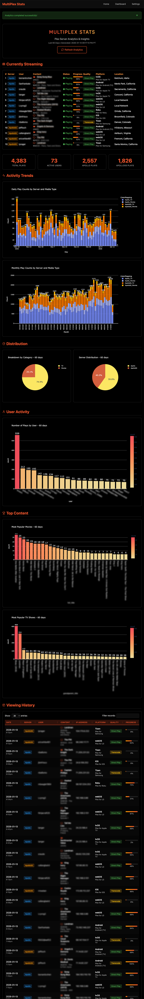

# MultiPlex Stats

A web application for combining and visualizing statistics from multiple Tautulli/Plex servers in one unified dashboard.



---

## Features

- **Web Interface** - Configure servers and view analytics directly in your browser
- **Interactive Charts** - Plotly visualizations with hover details
- **Multi-Server Support** - Combine statistics from up to 2 Tautulli servers
- **User Analytics** - Track your most active users and viewing patterns
- **Content Insights** - Discover your most popular movies and TV shows
- **Viewing History** - Searchable table of all viewing activity
- **Trend Analysis** - Daily and monthly viewing trends over time

---

## Quick Start with Docker

### Basic Setup

```yaml
services:
  multiplex-stats:
    image: powertowerpro/multiplex_stats:latest
    container_name: multiplex-stats
    ports:
      - "8487:8487"
    volumes:
      - ./instance:/app/instance
    environment:
      - PUID=1000
      - PGID=1000
    restart: unless-stopped
```

Then run:
```bash
docker-compose up -d
```

Open your browser to: **http://localhost:8487**

### Pre-configured Setup (Optional)

You can pre-configure your Tautulli servers via environment variables. On first launch, use the "Import from Environment" button in Settings to load them.

```yaml
services:
  multiplex-stats:
    image: powertowerpro/multiplex_stats:latest
    container_name: multiplex-stats
    ports:
      - "8487:8487"
    volumes:
      - ./instance:/app/instance
    environment:
      - PUID=1000
      - PGID=1000
      # Primary server (required)
      - TAUTULLI_A_NAME=MyServer
      - TAUTULLI_A_IP=192.168.1.100:8181
      - TAUTULLI_A_APIKEY=your_api_key_here
      # - TAUTULLI_A_SSL=false
      # - TAUTULLI_A_VERIFY_SSL=false
      # Optional second server
      # - TAUTULLI_B_NAME=Server2
      # - TAUTULLI_B_IP=192.168.1.101:8181
      # - TAUTULLI_B_APIKEY=another_api_key
      # - TAUTULLI_B_SSL=false
      # - TAUTULLI_B_VERIFY_SSL=false
      # Timezone (optional, defaults to America/Los_Angeles)
      # - TZ=America/New_York
    restart: unless-stopped
```

**Finding Your Tautulli API Key:**
1. Open Tautulli in your browser
2. Navigate to: Settings > Web Interface > API
3. Copy the API key

---

## Clean Reset / Reinstall

To completely reset MultiPlex Stats and start fresh (removes all settings and cached data):

```bash
sudo docker stop multiplex-stats && \
sudo rm -rf instance/ && \
sudo docker compose pull multiplex-stats && \
sudo docker compose up -d multiplex-stats
```

---

## Using the Settings Page

### Server Configuration

1. Navigate to Settings from the navigation bar
2. Enter your server details:
   - **Server Name** - A friendly name (e.g., "Home Server")
   - **IP Address:Port** - Your Tautulli address (e.g., `192.168.1.100:8181`)
   - **API Key** - Your Tautulli API key
   - **Use HTTPS/SSL** - Check if your Tautulli uses HTTPS
   - **Verify SSL Certificate** - Only check if using a valid certificate (not self-signed)
   - **Server Order** - Select Server A (Primary) or Server B (Secondary)
3. Click "Save Server"

To add a second server, repeat the process and select "Server B".

### Import Viewing History

The viewing history table requires a one-time data load from Tautulli:

1. Set the number of days to load (default: 365)
2. Click "Load History Data"
3. Wait for the import to complete

After the initial load, new records are automatically appended when you refresh the dashboard.

### Analytics Settings

Customize your charts and analysis periods:

- **Daily Trend Days** - Days shown in the daily activity chart
- **Monthly Trend Months** - Months shown in the monthly chart
- **History Days** - Days used for user activity and top content charts
- **Top Movies/TV Shows/Users** - Number of items to display in rankings

---

## Running Analytics

1. Go to the Home page
2. Click "Run Analytics"
3. View your dashboard with charts and statistics

Use the "Refresh Analytics" button on the dashboard to update with the latest data.

---

## Privacy and Security

- All data stays on your machine (no external services)
- API keys are stored in a local SQLite database
- No telemetry or tracking

---

## Support

- **Issues**: [GitHub Issues](https://github.com/apollolabsai/MultiPlex-Stats/issues)
- **Releases**: [GitHub Releases](https://github.com/apollolabsai/MultiPlex-Stats/releases)

---

## License

This project is open source and available under the MIT License.

---

## Acknowledgments

- **Tautulli** - Plex monitoring tool that provides the API
- **Plotly** - Interactive charting library
- **Flask** - Web framework
